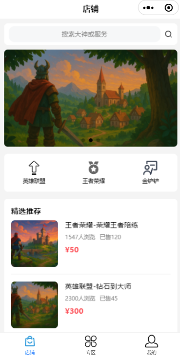
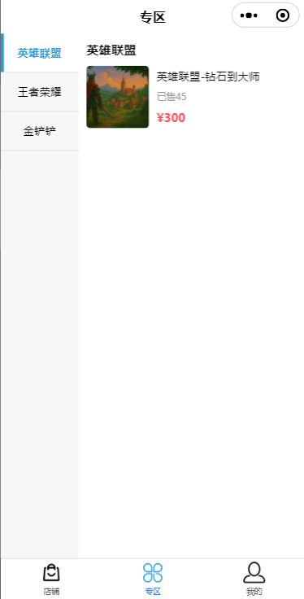
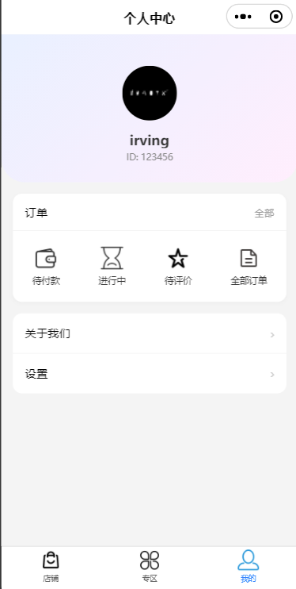
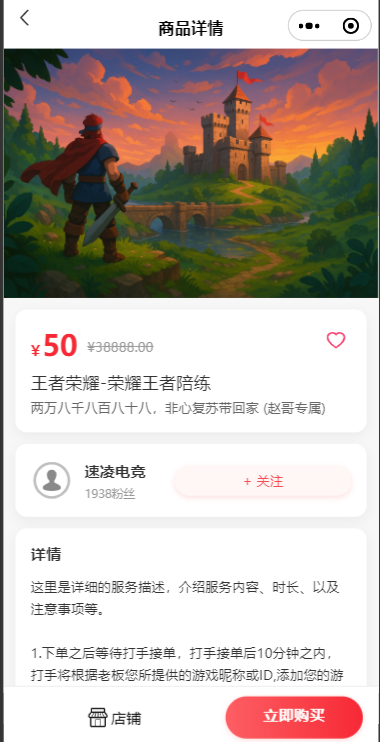
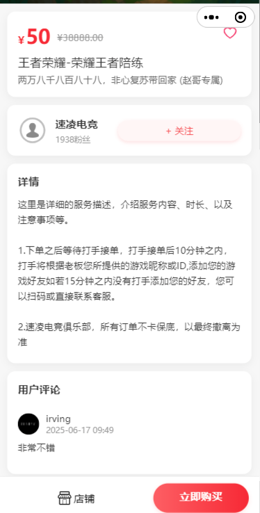
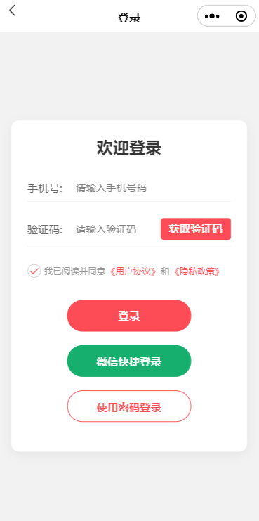
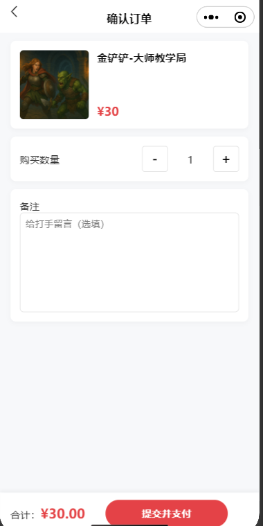
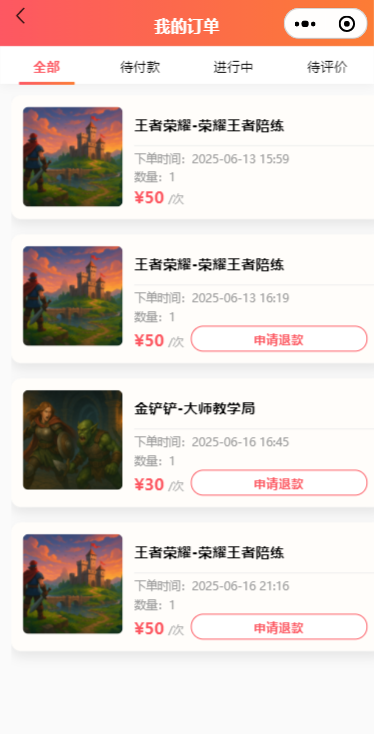

# E-sports Service Platform

[中文版](README_zh.md)

This is a full-stack e-sports service platform featuring a WeChat Mini Program frontend and a Java Spring Boot backend. The application is designed as an e-commerce platform where users can browse, purchase, and review e-sports services like coaching and team play sessions.

---

## App Demo

Below are some screenshots to help you get familiar with the platform’s key features and page flows (located in the `README.images` directory):

| Home (Shop) | Zone | Personal Center |
| :---: | :---: | :---: |
|  |  |  |

| Product Details | Product Details (including reviews) | Login Page |
| :---: | :---: | :---: |
|  |  |  |

| Order Confirmation | My Order List |
| :---: | :---: |
|  |  |

**Page Function Description:**
- **Homepage/Store**: Browse categories, featured recommendations and search services.
- **Special Zone**: Browse different types of e-sports services by category.
- **Personal Center**: View personal information, order status and settings.
- **Product Details**: View service introduction, price, seller information and user comments, support collection and order placement.
- **Order Related**: Place an order, confirm, pay and apply for a refund, and the order history is clear at a glance.
- **User Login**: Support verification code and WeChat quick login.
- **Comment System**: You can comment on the order after the service has been completed.
---

## Features

### Frontend (WeChat Mini Program)

* **Custom Navigation**: A reusable custom navigation bar component for a consistent look and feel across all pages. 
* **User Authentication**: Secure login via WeChat, allowing for a seamless user experience. 
* **Profile Management**: Users can update their nickname and upload a custom avatar. 
* **Shop**: A central marketplace to display services, including:
    * Promotional banners. 
    * Service categories. 
    * A list of featured/recommended services. 
    * Search functionality to find specific services. 
* **Product Details**: A detailed view for each service, showing its description, price, and user reviews. 
* **Favorites**: Users can add or remove services from their favorites list. 
* **Order Management**:
    * A streamlined order confirmation and creation process. 
    * A comprehensive order history page with tabs for different statuses (All, Pending Payment, Ongoing, Pending Comment). 
    * Functionality to simulate payment for orders. 
    * An option to request a refund for an ongoing order. 
* **Commenting System**: Users can rate and write reviews for the services they have purchased. 
* **Categorized Zone**: A dedicated area to browse services filtered by a specific category. 

### Backend (Java / Spring Boot)

* **RESTful API**: A complete set of API endpoints to support all frontend features.
* **Authentication Service**: Manages user identity using WeChat's `jscode2session` API and Redis for token storage. 
* **Shop Service**: Manages the retrieval of banners, categories, and products (including filtering and searching). 
* **Order Service**: Handles the creation and retrieval of user orders based on status. 
* **Payment Service**: Simulates payment and refund processes by updating order statuses and creating payment records. 
* **Favorite Service**: A Redis-based implementation to efficiently manage user favorites. 
* **File Uploads**: An endpoint for uploading user avatars to a designated server directory. 
* **Database Seeding**: A data initializer to populate the database with mock data for development purposes. 

## Technology Stack

| Area    | Technology/Framework                                       |
| :------ | :--------------------------------------------------------- |
| **Backend** | Java, Spring Boot, Spring Data JPA, Spring Web, MySQL, Redis, Lombok, Maven |
| **Frontend**| WeChat Mini Program, TypeScript, WXML, WXSS                |
| **Tools** | WeChat DevTools, Git                                       |

## Project Structure

The project is organized into two main parts: the backend server and the frontend mini program.

```
.
├── esports/            # Spring Boot backend application
│   └── src/main/java/
│       └── com/esports/esports/
│           ├── config/         # Spring configuration (Web, Redis, DataInitializer)
│           ├── controller/     # REST API endpoints
│           ├── model/          # JPA entities and DTOs
│           ├── repository/     # Spring Data JPA repositories
│           └── service/        # Business logic
│
└── miniprogram/        # WeChat Mini Program frontend
    ├── components/     # Reusable components
    ├── pages/          # Application pages
    ├── utils/          # Utility functions (request.ts, payment.ts, etc.)
    └── assets/         # Static images and icons
```

## Setup and Installation

### Backend (esports/)

1.  **Database Setup**:
    * Ensure you have a running MySQL instance.
    * Create a database named `esports_db`.

2.  **Configuration**:
    * Open `esports/src/main/resources/application.properties`. 
    * Update `spring.datasource.url`, `spring.datasource.username`, and `spring.datasource.password` to match your MySQL setup.
    * Update `redis.host`, `redis.port`, etc., to point to your Redis instance.
    * Update `wx.appid` and `wx.secret` with your WeChat Mini Program credentials.
    * Set the `app.upload-dir` property to a valid directory on your local machine for storing uploaded files (e.g., `D:/esports_uploads/`).

3.  **Data Initialization (First Run)**:
    * In `application.properties`, set `app.init-data=true`.  This will populate the database with mock categories, products, and users when the application starts.
    * Run the application once.
    * Change `app.init-data` back to `false` for subsequent runs.

4.  **Run Application**:
    * Execute the `main` method in `EsportsApplication.java` to start the server. 
    * The backend API will be available at `http://127.0.0.1:8080/api`.

### Frontend (miniprogram/)

1.  **Import Project**:
    * Open WeChat DevTools.
    * Choose "Import Project" and select the `miniprogram/` directory.

2.  **Configure API Endpoint**:
    * Open the file `miniprogram/utils/request.ts`.
    * Update the `BASE_URL` constant to point to your backend server: `const BASE_URL = 'http://127.0.0.1:8080/api';`. 

3.  **Development Settings**:
    * In WeChat DevTools, go to "Details" -> "Local Settings".
    * Check the box for "Do not verify legal domain name, web-view (business domain name), TLS version and HTTPS certificate". This is required for local development.

4.  **Run**:
    * Click "Compile" in WeChat DevTools to run the Mini Program.

## API Endpoints

A summary of the main backend API endpoints. All endpoints are prefixed with `/api`.

| Method | Endpoint                      | Description                                                  |
| :----- | :---------------------------- | :----------------------------------------------------------- |
| `POST` | `/wxlogin`                    | Logs in a user with a WeChat code and returns a token.  |
| `PUT`  | `/users/me`                   | Updates the current user's profile (nickname, avatar).        |
| `POST` | `/upload/avatar`              | Uploads an avatar image.                                  |
| `GET`  | `/shop/banners`               | Retrieves a list of promotional banners.                      |
| `GET`  | `/shop/categories`            | Retrieves all product categories.                       |
| `GET`  | `/shop/products`              | Searches for products or gets products by category.    |
| `GET`  | `/shop/products/featured`     | Retrieves a list of featured products.                |
| `GET`  | `/shop/products/{id}`         | Gets details for a specific product.                          |
| `POST` | `/orders`                     | Creates a new order for the logged-in user.             |
| `GET`  | `/orders`                     | Gets the user's orders, with an option to filter by status.  |
| `POST` | `/pay/{orderId}`              | Simulates payment for a specific order.                       |
| `POST` | `/pay/{orderId}/refund`       | Simulates a refund for a specific order.                      |
| `GET`  | `/comments`                   | Gets all comments for a specific product.                     |
| `POST` | `/comments`                   | Adds a new comment to an order.                               |
| `GET`  | `/favorites`                  | Gets the current user's list of favorited product IDs.  |
| `GET`  | `/favorites/{productId}`      | Checks if a specific product is favorited by the user.    |
| `POST` | `/favorites`                  | Adds a product to the user's favorites.                      |
| `DELETE`| `/favorites/{productId}`    | Removes a product from the user's favorites.                |

---
