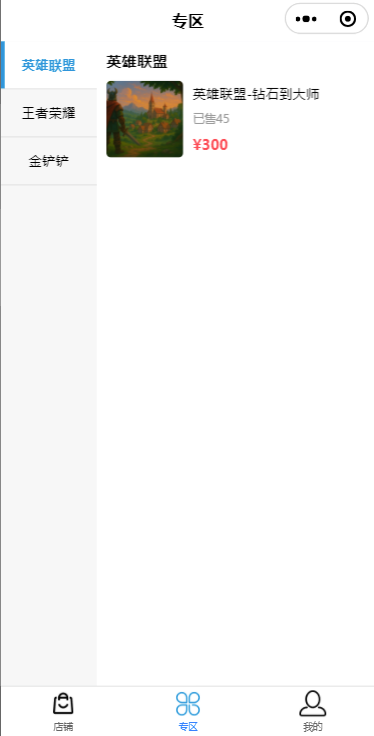
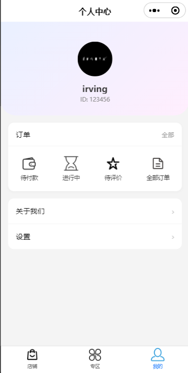
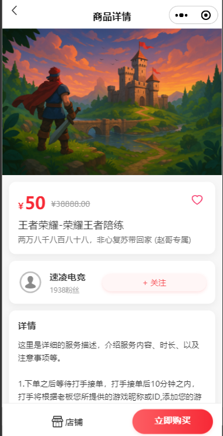
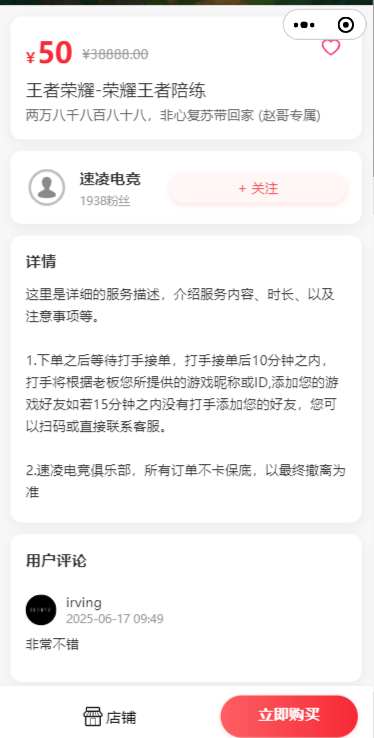
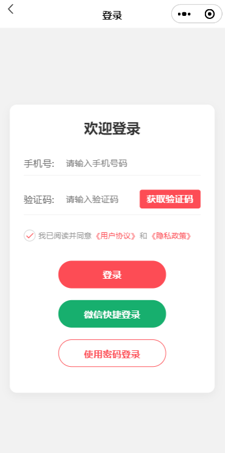
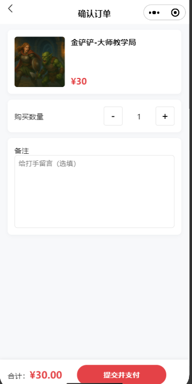
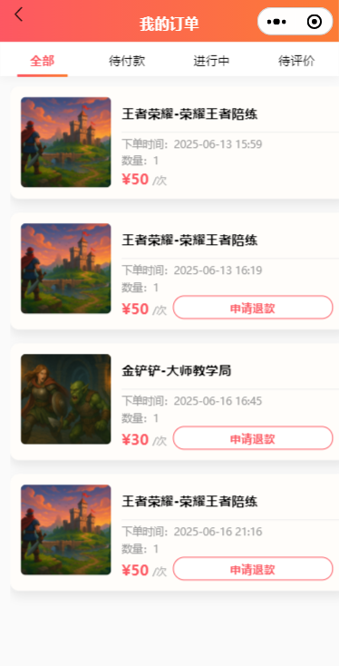

# 电竞服务平台

[English Version](README.md)

这是一个全栈的电竞服务平台，前端为微信小程序，后端为 Java Spring Boot。该应用旨在作为一个电商平台，用户可以浏览、购买和评价诸如陪玩、教学等电竞服务。

---

## 应用演示

下面是一些关键页面功能的截图（位于 `README.images` 目录）：

| 首页（商店） | 专区 | 个人中心 |
| :---: | :---: | :---: |
|  |  |  |

| 商品详情 | 商品详情（含评论） | 登录页 |
| :---: | :---: | :---: |
|  |  |  |

| 确认订单 | 我的订单列表 |
| :---: | :---: |
|  |  |

**页面功能说明：**
- **首页/商店**：浏览类别、精选推荐和搜索服务。
- **专区**：按类别浏览不同类型的电竞服务。
- **个人中心**：查看个人信息、订单状态和设置。
- **商品详情**：查看服务介绍、价格、商家信息和用户评论，支持收藏与下单。
- **订单相关**：下单、确认、支付、申请退款，订单历史一目了然。
- **用户登录**：支持验证码和微信一键登录。
- **评论系统**：服务完成后可对订单进行评论。

---

## 功能特性

### 前端（微信小程序）

* **自定义导航**：可复用的自定义导航栏组件，确保页面风格统一。
* **用户认证**：微信授权安全登录，用户体验无缝衔接。
* **个人信息管理**：用户可更新昵称并上传头像。
* **商店**：服务展示中心，包括：
    * 轮播图推广
    * 服务类别
    * 精选/推荐服务列表
    * 支持服务搜索
* **商品详情**：展示服务详细介绍、价格及用户评价。
* **收藏功能**：可添加或移除服务收藏。
* **订单管理**：
    * 简洁的订单确认和创建流程
    * 订单历史页支持按不同状态（全部、待支付、进行中、待评价）切换
    * 支持订单支付模拟
    * 进行中订单可申请退款
* **评论系统**：用户可对购买的服务进行评分和评价
* **专区浏览**：专门区域按分类筛选服务

### 后端（Java / Spring Boot）

* **RESTful API**：为所有前端功能提供完整接口
* **认证服务**：基于微信 `jscode2session` 接口和 Redis 令牌存储实现身份管理
* **商店服务**：管理轮播图、分类和商品（含筛选、搜索）
* **订单服务**：根据状态创建和查询用户订单
* **支付服务**：通过变更订单状态和生成支付记录模拟支付、退款流程
* **收藏服务**：基于 Redis 高效管理用户收藏
* **文件上传**：提供上传用户头像接口，存储于指定服务器目录
* **数据库初始化**：提供数据初始化工具，方便开发时填充模拟数据

## 技术栈

| 区域    | 技术/框架                                    |
| :------ | :------------------------------------------ |
| **后端** | Java、Spring Boot、Spring Data JPA、Spring Web、MySQL、Redis、Lombok、Maven |
| **前端** | 微信小程序、TypeScript、WXML、WXSS              |
| **工具** | 微信开发者工具、Git                             |

## 项目结构

项目分为两大部分：后端服务器和前端小程序。

```
.
├── esports/            # Spring Boot 后端应用
│   └── src/main/java/
│       └── com/esports/esports/
│           ├── config/         # Spring 配置（Web、Redis、数据初始化）
│           ├── controller/     # REST API 接口
│           ├── model/          # JPA 实体和 DTO
│           ├── repository/     # Spring Data JPA 仓库
│           └── service/        # 业务逻辑
│
└── miniprogram/        # 微信小程序前端
    ├── components/     # 可复用组件
    ├── pages/          # 应用页面
    ├── utils/          # 工具函数（request.ts、payment.ts 等）
    └── assets/         # 静态图片和图标
```

## 安装与部署

### 后端（esports/）

1.  **数据库准备**：
    * 保证本地 MySQL 正常运行。
    * 新建数据库 `esports_db`。

2.  **配置**：
    * 编辑 `esports/src/main/resources/application.properties`。
    * 配置 `spring.datasource.url`、`spring.datasource.username`、`spring.datasource.password`，与本地 MySQL 信息一致。
    * 配置 `redis.host`、`redis.port` 等参数，指向你的 Redis 实例。
    * 配置 `wx.appid`、`wx.secret`，填写你的小程序信息。
    * 配置 `app.upload-dir`，填写用于存放上传文件的本地有效目录（如 `D:/esports_uploads/`）。

3.  **初始化数据（首次运行）**：
    * 配置 `app.init-data=true`，首次启动时会自动填充模拟类别、商品、用户等数据。
    * 启动应用后，记得将 `app.init-data` 改回 `false`，以免重复初始化。

4.  **运行**：
    * 执行 `EsportsApplication.java` 的 `main` 方法启动服务。
    * 后端 API 访问地址为 `http://127.0.0.1:8080/api`。

### 前端（miniprogram/）

1.  **导入项目**：
    * 打开微信开发者工具。
    * 选择“导入项目”，路径选择 `miniprogram/`。

2.  **配置 API 地址**：
    * 打开 `miniprogram/utils/request.ts`。
    * 将 `BASE_URL` 常量改为你的后端地址：`const BASE_URL = 'http://127.0.0.1:8080/api';`。

3.  **开发设置**：
    * 微信开发者工具 -> “详情” -> “本地设置”
    * 勾选“关闭域名合法性校验、web-view（业务域名）、TLS 版本以及 HTTPS 证书校验”选项（本地开发必选）。

4.  **运行**：
    * 点击微信开发者工具的“编译”运行小程序。

## API 接口

主后台接口列表，所有接口均以 `/api` 为前缀。

| 方法   | 接口地址                     | 说明                                    |
| :----- | :--------------------------- | :-------------------------------------- |
| `POST` | `/wxlogin`                   | 微信登录，返回用户令牌。                |
| `PUT`  | `/users/me`                  | 更新当前用户信息（昵称、头像）。         |
| `POST` | `/upload/avatar`             | 上传头像图片。                          |
| `GET`  | `/shop/banners`              | 获取首页轮播图列表。                    |
| `GET`  | `/shop/categories`           | 获取所有商品分类。                      |
| `GET`  | `/shop/products`             | 查询商品或按分类获取商品。              |
| `GET`  | `/shop/products/featured`    | 获取精选商品列表。                      |
| `GET`  | `/shop/products/{id}`        | 获取指定商品详情。                      |
| `POST` | `/orders`                    | 创建新订单。                            |
| `GET`  | `/orders`                    | 获取用户订单，可按状态筛选。            |
| `POST` | `/pay/{orderId}`             | 对指定订单模拟支付。                    |
| `POST` | `/pay/{orderId}/refund`      | 对指定订单模拟退款。                    |
| `GET`  | `/comments`                  | 获取指定商品全部评论。                  |
| `POST` | `/comments`                  | 对订单添加新评论。                      |
| `GET`  | `/favorites`                 | 获取当前用户收藏商品 ID 列表。          |
| `GET`  | `/favorites/{productId}`     | 检查某商品是否已被收藏。                |
| `POST` | `/favorites`                 | 添加商品到用户收藏。                    |
| `DELETE`| `/favorites/{productId}`    | 移除收藏的商品。                        |

---
